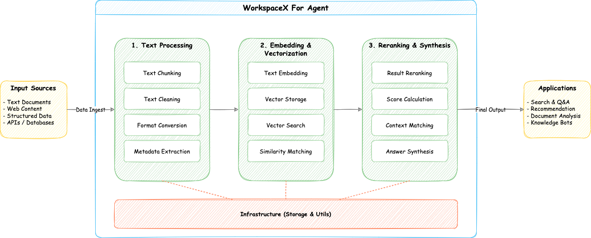

# workspacex

**workspacex** is a Python library for managing AIGC (AI-Generated Content) artifacts. It provides a collaborative workspace environment for handling multiple artifacts with features like version control, update notifications, artifact management, and pluggable storage and embedding backends.


---

## Features

- **Artifact Management**: Create, update, and manage different types of artifacts (text, code, novels, etc.)
- **Workspace Organization**: Group related artifacts in collaborative workspaces
- **Storage Backends**: Local file system and S3-compatible storage (via `s3fs`)
- **Embedding Backends**: OpenAI-compatible and Ollama embedding support
- **Vector Search**: Hybrid search combining semantic and keyword-based search
- **Reranking**: Local reranking using Qwen3-Reranker models
- **HTTP Service**: FastAPI-based reranking service

---

## Installation

### Basic Installation
```bash
pip install workspacex
```

### With Reranker Support
```bash
pip install "workspacex[reranker]"  # For using reranker in your code
pip install "workspacex[reranker-server]"  # For running the reranker HTTP service
```

Using Poetry:
```bash
poetry install --extras "reranker-server"  # Installs all features
```

---

## Usage

### Basic Example

```python
import asyncio
import logging

from workspacex import WorkSpace, ArtifactType

if __name__ == '__main__':
    workspace = WorkSpace.from_local_storages(workspace_id="demo")
    asyncio.run(workspace.create_artifact(ArtifactType.TEXT, "artifact_001"))
```

### More Examples

For more detailed examples on features like reranking, storage/embedding backends, and hybrid search, please refer to the scripts in the `src/examples/` directory.

To run an example:
```bash
export PYTHONPATH=src
python src/examples/embeddings/openai_example.py
```


### Running the Reranker Server

1. Install server dependencies:
```bash
pip install "workspacex[reranker-server]"
```

2. Start the server:
```bash
python -m workspacex.reranker.server.reranker_server
```

> Default model: Qwen/Qwen3-Reranker-0.6B
> 
> To download the model first:
> ```bash
> # Install huggingface_hub
> pip install -U huggingface_hub
> 
> # Set mirror for faster download in China
> export HF_ENDPOINT=https://hf-mirror.com
> 
> # Download the model
> huggingface-cli download --resume-download Qwen/Qwen3-Reranker-0.6B --local-dir Qwen/Qwen3-Reranker-0.6B
> ```

The server can be configured with these environment variables:
```
RERANKER_MODEL=Qwen/Qwen3-Reranker-0.6B  # or Qwen/Qwen3-Reranker-8B
RERANKER_PORT=8000
RERANKER_RELOAD=False
```

The server will start on http://localhost:8000. Interactive API docs are available at `/docs` and `/redoc`. It provides endpoints like `/rerank` and a Dify-compatible `/dify/rerank`.

---

## Notes

- All source code is under `src/`.
- Make sure to activate the correct conda environment before using Poetry commands or running code.
- If you see `ModuleNotFoundError: No module named 'workspacex'`, ensure your `PYTHONPATH` includes `src`.
- Storage and embedding backends are pluggable and extensible.
- For S3 support, install `s3fs` and configure credentials as needed.
- For reranking, CUDA is recommended for better performance.
- The reranker server supports both CPU and GPU inference.

---

Let me know if you want to add more details, such as advanced usage, API docs, or contribution guidelines!
