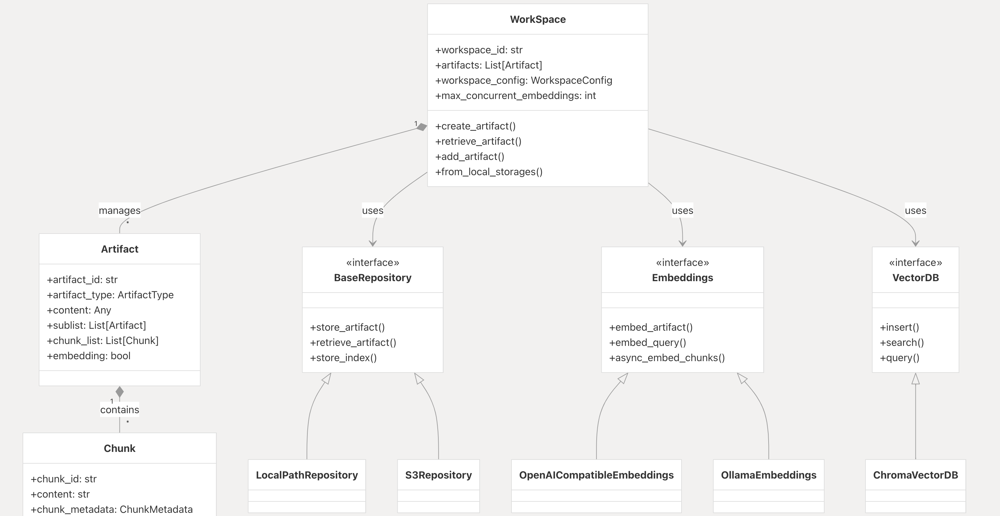
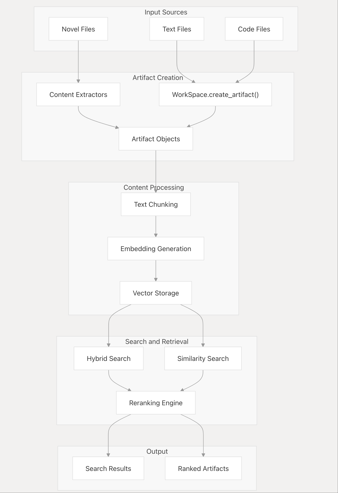

# workspacex

[](https://opensource.org/licenses/MIT)
[](https://deepwiki.com/wuhulala/workspacex)


**workspacex** is a Python library for managing AIGC (AI-Generated Content) artifacts. It provides a collaborative workspace environment for handling multiple artifacts with features like version control, update notifications, artifact management, and pluggable storage and embedding backends.

{width=800px height=400px}
## Features

- **Artifact Management**: Create, update, and manage different types of artifacts (text, code, novels, etc.)
- **Workspace Organization**: Group related artifacts in collaborative workspaces
- **Parallel Processing**: 🚀 Subartifacts are processed in parallel for improved performance
- **Storage Backends**: Local file system and S3-compatible storage (via `s3fs`)
- **Embedding Backends**: OpenAI-compatible and Ollama embedding support
- **Vector Search**: Hybrid search combining semantic and keyword-based search
- **Full-Text Search**: Elasticsearch-based full-text search with Chinese analyzer support
- **Reranking**: Local reranking using Qwen3-Reranker models
- **HTTP Service**: FastAPI-based reranking service

## Process

{width=400px height=800px}

---

## Installation

### Basic Installation
```bash
pip install workspacex
```

### With Reranker Support
```bash
pip install "workspacex[reranker]"  # For using reranker in your code
pip install "workspacex[reranker-server]"  # For running the reranker HTTP service
```

Using Poetry:
```bash
poetry install --extras "reranker-server"  # Installs all features
```

---

## Usage

### Basic Example

```python
import asyncio
from workspacex.utils.logger import logger

from workspacex import WorkSpace, ArtifactType

if __name__ == '__main__':
    workspace = WorkSpace.from_local_storages(workspace_id="demo")
    asyncio.run(workspace.create_artifact(ArtifactType.TEXT, "artifact_001"))
```

### Parallel Processing Demo

WorkspaceX now supports **high-performance parallel processing** of artifacts and subartifacts, providing significant performance improvements:

**Key Features:**
- 🚀 **Full Parallel Processing**: Main artifacts and subartifacts processed simultaneously
- ⚡ **Thread Pool Optimization**: CPU-intensive operations moved to thread pool
- 🎯 **Configurable Concurrency**: Control concurrent operations with `max_concurrent_embeddings`
- 🛡️ **Error Handling**: Robust error handling with detailed logging
- 📊 **Performance Monitoring**: Real-time performance metrics and logging

```python
import asyncio
from workspacex import WorkSpace, ArtifactType

async def demo_enhanced_parallel_processing():
    workspace = WorkSpace(workspace_id="parallel_demo", clear_existing=True)
    
    # Configure concurrency limits (optional)
    workspace.workspace_config.max_concurrent_embeddings = 10
    
    # Create an artifact with multiple subartifacts
    # All artifacts and subartifacts will be processed in parallel for maximum performance
    await workspace.create_artifact(
        artifact_type=ArtifactType.NOVEL,
        novel_file_path="path/to/novel.txt",
        embedding_flag=True  # Enables parallel embedding processing
    )

# Run the demo
asyncio.run(demo_enhanced_parallel_processing())
```

**Performance Improvements:**
- **Sequential Processing**: ~1.0x baseline
- **Parallel Subartifacts Only**: ~2-3x faster
- **Full Parallel Processing**: ~5-10x faster
- **Batch Processing**: ~10-20x faster

For a complete performance comparison demo, see `src/examples/parallel_processing_example.py`.

### More Examples

For more detailed examples on features like reranking, storage/embedding backends, hybrid search, and Chinese full-text search, please refer to the scripts in the `src/examples/` directory.

To run an example:
```bash
export PYTHONPATH=src
python src/examples/embeddings/openai_example.py
```


## Running the Reranker Server[Optional]

1. Install server dependencies:
```bash
pip install "workspacex[reranker-server]"
```

2. Start the server:
```bash
python -m workspacex.reranker.server.reranker_server
```

> Default model: Qwen/Qwen3-Reranker-0.6B
> 
> To download the model first:
> ```bash
> # Install huggingface_hub
> pip install -U huggingface_hub
> 
> # Set mirror for faster download in China
> export HF_ENDPOINT=https://hf-mirror.com
> 
> # Download the model
> huggingface-cli download --resume-download Qwen/Qwen3-Reranker-0.6B --local-dir Qwen/Qwen3-Reranker-0.6B
> ```

The server can be configured with these environment variables:
```
RERANKER_MODEL=Qwen/Qwen3-Reranker-0.6B  # or Qwen/Qwen3-Reranker-8B
RERANKER_PORT=8000
RERANKER_RELOAD=False
```

The server will start on http://localhost:8000. Interactive API docs are available at `/docs` and `/redoc`. It provides endpoints like `/rerank` and a Dify-compatible `/dify/rerank`.

---

## Changelog

